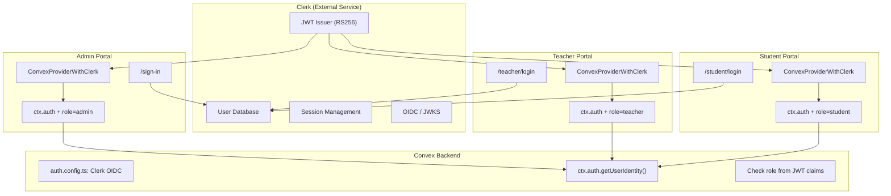
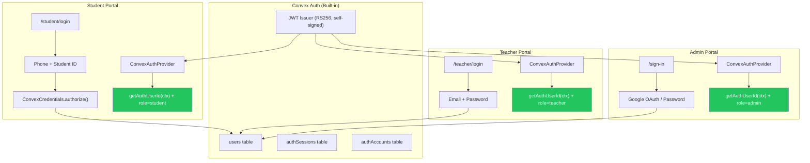

# Auth Architecture - Maple Diary

## Current State (What We Have Now)

### 3 Portals, 2 Auth Systems

| Portal | Auth System | Login Method | Convex Security |
|--------|------------|-------------|-----------------|
| Admin | Clerk (OIDC) | Google/Email via Clerk UI | ctx.auth via JWT template |
| Teacher | Custom JWT (HS256) | Email + Password | Token verified via `requireTeacher()` |
| Student | Custom JWT (HS256) | Phone + Student ID | Token verified via `requireStudent()` |

### How Each Portal Works

**Admin Portal (Clerk)**
- User visits `/dashboard` -> Clerk middleware checks session
- No session -> redirect to `/sign-in` -> Clerk handles login
- Clerk issues JWT with `aud: "convex"` -> sent to Convex automatically
- Convex verifies via OIDC (JWKS public key from Clerk)
- `ctx.auth.getUserIdentity()` available in backend functions

**Teacher Portal (Custom JWT)**
- User visits `/teacher/*` -> middleware checks `maple_teacher_token` cookie
- No token -> redirect to `/teacher/login` -> enter email + password
- API route calls `teacherAuth.login` -> bcrypt verifies password
- JWT signed with `JWT_SECRET` (HS256) -> stored in cookie
- Every Convex query/mutation receives `token` arg
- Backend calls `requireTeacher(token, staffId)` -> verifies JWT + matches staff ID

**Student Portal (Custom JWT)**
- User visits `/student/*` -> middleware checks `maple_student_token` cookie
- No token -> redirect to `/student/login` -> enter phone + student ID
- API route calls `studentAuth.login` -> verifies phone + studentId match
- JWT signed with `JWT_SECRET` (HS256) -> stored in cookie
- Every Convex query/mutation receives `token` arg
- Backend calls `requireStudent(token, studentId)` -> verifies JWT + matches student ID

### Security Flow Diagram

```mermaid
flowchart TB
    subgraph Admin["Admin Portal - Clerk"]
        A1["/sign-in"] --> A2["Clerk Auth"]
        A2 --> A3["Clerk JWT (RS256, OIDC)"]
        A3 --> A4["Convex verifies via JWKS"]
        A4 --> A5["ctx.auth.getUserIdentity()"]
    end

    subgraph Teacher["Teacher Portal - Custom JWT"]
        T1["/teacher/login"] --> T2["Email + Password"]
        T2 --> T3["bcrypt verify -> JWT (HS256)"]
        T3 --> T4["Cookie: maple_teacher_token"]
        T4 --> T5["Token passed to every query/mutation"]
        T5 --> T6["requireTeacher(token, staffId)"]
        T6 --> T7["JWT verified + staff ID matched"]
    end

    subgraph Student["Student Portal - Custom JWT"]
        S1["/student/login"] --> S2["Phone + Student ID"]
        S2 --> S3["Verify match -> JWT (HS256)"]
        S3 --> S4["Cookie: maple_student_token"]
        S4 --> S5["Token passed to every query/mutation"]
        S5 --> S6["requireStudent(token, studentId)"]
        S6 --> S7["JWT verified + student ID matched"]
    end

    style A5 fill:#22c55e,color:#fff
    style T7 fill:#22c55e,color:#fff
    style S7 fill:#22c55e,color:#fff
```



All three portals now have server-side auth verification (green).

---

## Option A: Full Clerk Auth (All 3 Portals)

### How It Would Work

All users become Clerk users. Role stored in Clerk `publicMetadata.role`.

| Portal | Login Method | Clerk Feature |
|--------|-------------|---------------|
| Admin | Google OAuth / Email+Password | Standard sign-in |
| Teacher | Email + Password | Standard sign-in with role check |
| Student | Email + Password (or Phone OTP) | Standard sign-in with role check |

### Architecture



### Setup Required

**Clerk Dashboard:**
- Create users for each teacher/student (manually or via API)
- Set `publicMetadata.role` = "admin" | "teacher" | "student"
- Set `publicMetadata.staffId` or `publicMetadata.studentDocId` to link to Convex tables
- Configure JWT template with custom claims:
  ```json
  {
    "role": "{{user.public_metadata.role}}",
    "staffId": "{{user.public_metadata.staffId}}",
    "studentDocId": "{{user.public_metadata.studentDocId}}"
  }
  ```

**Convex:**
```ts
// auth.config.ts — same as now, single Clerk provider
export default {
  providers: [{
    domain: "https://calm-muskrat-7.clerk.accounts.dev",
    applicationID: "convex",
  }],
};

// In any backend function:
const identity = await ctx.auth.getUserIdentity();
if (identity?.role !== "teacher") throw new Error("Unauthorized");
const staffId = identity.staffId; // from JWT custom claims
```

**Frontend:**
- All 3 portals use `ConvexProviderWithClerk`
- Single middleware using `clerkMiddleware()`
- Teacher/student login: Clerk `<SignIn>` component with redirect based on role
- Or custom sign-in forms that call `signIn.create({ identifier, password })`

### What Changes

| File | Change |
|------|--------|
| `convex/auth.config.ts` | No change (already Clerk) |
| `convex/teacherAuth.ts` | DELETE |
| `convex/studentAuth.ts` | DELETE |
| `convex/lib/auth.ts` | DELETE (bcrypt/jose not needed) |
| `convex/lib/portalAuth.ts` | REPLACE with `requireRole(ctx, "teacher")` |
| `src/middleware.ts` | Simplify to single Clerk middleware |
| `src/providers/TeacherAuthProvider.tsx` | DELETE |
| `src/providers/StudentAuthProvider.tsx` | DELETE |
| `src/providers/ConvexPortalProvider.tsx` | DELETE (use ConvexClientProvider for all) |
| `src/app/api/auth/*` | DELETE (Clerk handles login/logout) |

### Student Login Problem

Clerk does NOT support "phone + student ID" as a login method. Options:
1. **Change to email + password** — students get email/password like teachers
2. **Phone OTP** — Clerk sends SMS code, costs $0.01/SMS via Clerk
3. **Custom flow** — Use Clerk Backend API to create a custom sign-in, but complex

This is the **biggest friction point** with full Clerk.

### Cost

| Users | Clerk Pricing |
|-------|--------------|
| < 10,000 MAU | Free |
| 10,000 - 100,000 MAU | $25/mo + $0.02/MAU over 10K |
| 100,000+ MAU | Custom pricing |

For a school with 50 staff + 500 students = ~550 MAU = **Free tier**.
But grows with scale.

---

## Option B: Convex Auth (All 3 Portals)

### How It Would Work

All auth handled inside Convex. No external service.

| Portal | Login Method | Convex Auth Provider |
|--------|-------------|---------------------|
| Admin | Google OAuth or Email+Password | `Google` or `Password` |
| Teacher | Email + Password | `Password` |
| Student | Phone + Student ID | `ConvexCredentials({ id: "student" })` |

### Architecture



### Setup Required

**Convex Backend:**
```ts
// convex/auth.ts
import { convexAuth } from "@convex-dev/auth/server";
import { Password } from "@convex-dev/auth/providers/Password";
import ConvexCredentials from "@convex-dev/auth/providers/ConvexCredentials";
import Google from "@auth/core/providers/google";

export const { auth, signIn, signOut, store } = convexAuth({
  providers: [
    // Admin: Google OAuth
    Google,
    // Teacher: Email + Password
    Password({
      id: "teacher-password",
      profile(params) {
        return { email: params.email as string, role: "teacher" };
      },
    }),
    // Student: Phone + Student ID (custom)
    ConvexCredentials({
      id: "student-login",
      authorize: async (credentials, ctx) => {
        const phone = credentials.phone as string;
        const studentId = credentials.studentId as string;
        // Verify against students table
        // Return { userId } on success
      },
    }),
  ],
});
```

**Schema:**
```ts
// convex/schema.ts
import { authTables } from "@convex-dev/auth/server";

export default defineSchema({
  ...authTables,  // users, authSessions, authAccounts, etc.
  staff: { ... },
  students: { ... },
  // users table links to staff/students via role + reference ID
});
```

**Frontend:**
```tsx
// All portals use ConvexAuthProvider
import { ConvexAuthProvider } from "@convex-dev/auth/react";
<ConvexAuthProvider client={convex}>{children}</ConvexAuthProvider>

// Login forms use useAuthActions()
const { signIn } = useAuthActions();
await signIn("teacher-password", { email, password, flow: "signIn" });
await signIn("student-login", { phone, studentId });
```

### What Changes

| File | Change |
|------|--------|
| `convex/auth.config.ts` | Point to Convex site URL (self-issued JWTs) |
| `convex/auth.ts` | NEW — Convex Auth config with 3 providers |
| `convex/http.ts` | NEW — Register auth HTTP routes |
| `convex/schema.ts` | Add `authTables` |
| `convex/teacherAuth.ts` | DELETE |
| `convex/studentAuth.ts` | DELETE |
| `convex/lib/auth.ts` | DELETE |
| `convex/lib/portalAuth.ts` | REPLACE with `getAuthUserId(ctx)` |
| `src/middleware.ts` | Use `convexAuthNextjsMiddleware` |
| `src/providers/*` | Replace ALL with single `ConvexAuthProvider` |
| `src/app/api/auth/*` | DELETE |
| `package.json` | Remove `@clerk/nextjs`, add `@convex-dev/auth` |

### Student Login: Preserved

Phone + Student ID login works exactly as before via `ConvexCredentials`:
```ts
ConvexCredentials({
  id: "student-login",
  authorize: async (credentials, ctx) => {
    // Same logic as current studentAuth.login
    // but returns userId for Convex Auth session
  },
})
```

No login method changes for students.

### Cost

**Free.** Convex Auth is part of Convex — no extra billing.

---

## Head-to-Head Comparison

| Feature | Clerk (All 3) | Convex Auth (All 3) | Current (Hybrid) |
|---------|--------------|--------------------|--------------------|
| **Cost** | Free < 10K MAU, then $0.02/MAU | Free | Free (Clerk free tier) |
| **External dependency** | Yes (Clerk service) | No | Yes (Clerk for admin) |
| **Student phone+ID login** | NOT supported natively | Supported via ConvexCredentials | Supported (custom) |
| **ctx.auth in Convex** | Yes (all portals) | Yes (all portals) | Admin only |
| **Token passing in queries** | Not needed | Not needed | Required (teacher/student) |
| **Auth systems to maintain** | 1 | 1 | 2 |
| **Pre-built UI components** | Yes (Clerk `<SignIn>`) | No (build your own forms) | Partial |
| **Password reset** | Built-in (Clerk) | Built-in (Convex Auth) | Custom (Resend emails) |
| **Session management** | Clerk handles | Convex Auth handles | Manual (JWT expiry) |
| **Google/Social OAuth** | Built-in | Supported via @auth/core | Admin only (Clerk) |
| **User management UI** | Clerk Dashboard | Convex Dashboard | Custom admin pages |
| **Migration effort** | Medium | Medium | N/A (current state) |
| **Data ownership** | Users in Clerk (external) | Users in Convex (your DB) | Split |
| **Offline/self-hosted** | No | With self-hosted Convex | No |
| **Rate limiting** | Built-in | Built-in | None |
| **SDK stability** | Breaking changes (v5->v7) | Beta (may change) | Stable (custom code) |

---

## Recommendation

```
                    ┌─────────────────────────────────────────────┐
                    │           DECISION MATRIX                   │
                    ├─────────────────────────────────────────────┤
                    │                                             │
                    │  Need phone+studentId login?                │
                    │    YES ──> Convex Auth                      │
                    │    NO  ──> Either works                     │
                    │                                             │
                    │  Want zero external dependencies?           │
                    │    YES ──> Convex Auth                      │
                    │    NO  ──> Either works                     │
                    │                                             │
                    │  Want pre-built login UI components?        │
                    │    YES ──> Clerk                            │
                    │    NO  ──> Either works (you have custom)   │
                    │                                             │
                    │  Want all data in your Convex DB?           │
                    │    YES ──> Convex Auth                      │
                    │    NO  ──> Either works                     │
                    │                                             │
                    │  Scaling beyond 10K users?                  │
                    │    YES ──> Convex Auth (free)               │
                    │    NO  ──> Either works                     │
                    │                                             │
                    ├─────────────────────────────────────────────┤
                    │                                             │
                    │  RESULT: Convex Auth wins on 4/5 criteria   │
                    │                                             │
                    └─────────────────────────────────────────────┘
```

**Convex Auth is the better fit** because:
1. It preserves the student phone+studentId login (Clerk can't do this)
2. Zero cost, zero external dependency
3. All user data stays in your Convex DB
4. Native `ctx.auth` without token-passing hacks
5. You already have custom login forms — no need for Clerk's pre-built UI

**Clerk's only advantage** is pre-built UI components, but you've already built your own login pages.

---

## File Map (Current)

### Auth Files
```
convex/
  lib/auth.ts           — bcrypt + JWT helpers (hash, verify, sign, decode)
  lib/portalAuth.ts     — requireTeacher() / requireStudent() server guards
  teacherAuth.ts        — Teacher login action (public)
  teacherAuthInternal.ts — Staff lookup/password mutations (internal)
  studentAuth.ts        — Student login action (public)
  studentAuthInternal.ts — Student lookup mutations (internal)
  auth.config.ts        — Clerk OIDC provider config

src/
  middleware.ts          — 3-zone routing (teacher JWT, student JWT, Clerk)
  providers/
    ConvexClientProvider.tsx   — Clerk + Convex (admin)
    ConvexPortalProvider.tsx   — Plain Convex (teacher/student)
    TeacherAuthProvider.tsx    — Teacher JWT context + profile
    StudentAuthProvider.tsx    — Student JWT context + profile
  app/
    api/auth/teacher/    — Login/logout API routes
    api/auth/student/    — Login/logout API routes
```
